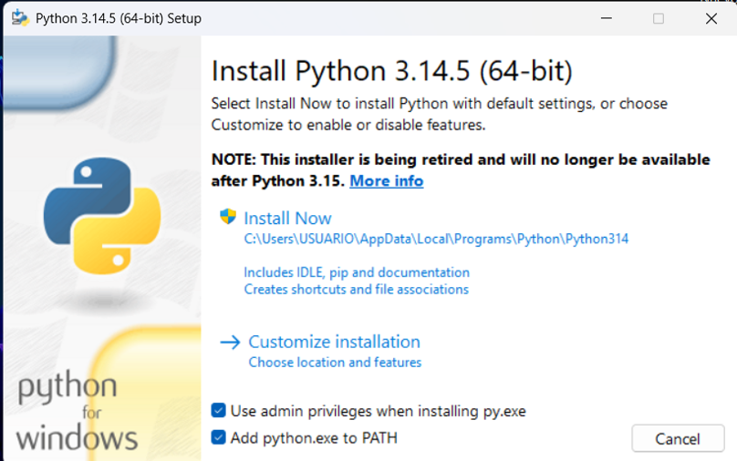

# Buscador Semántico de Repostería

Este proyecto es un buscador semántico desarrollado con **React** y **Flask**. Permite cargar una ontología en formato `.owx` y buscar información relacionada con productos, recetas, ingredientes, herramientas y relaciones del dominio de la repostería.

---

## 1. Descripción del proyecto

El sistema utiliza una ontología de repostería para representar conocimiento mediante clases, individuos, propiedades y relaciones.  
El buscador permite consultar elementos como:

- Productos de repostería
- Ingredientes
- Recetas
- Herramientas
- Clases
- Relaciones semánticas
- Atributos de los individuos

---

## 2. Tecnologías utilizadas

- **Python 3.14.5**
- **Flask**
- **React**
- **Tailwind CSS**
- **Typescript**
- **Ontología OWX / OWL XML**

---

## 3. Descargar e instalar Python

Para ejecutar el backend se debe instalar Python desde la página oficial:

<https://www.python.org/downloads/windows/>

Se recomienda usar **Python 3.14.5 (64-bit)** o una versión estable superior.

Al abrir el instalador de Python, antes de instalar se deben marcar las siguientes opciones:

- **Add python.exe to PATH**
- **Use admin privileges when installing py.exe**

La opción más importante es:

```text
Add python.exe to PATH
```

Esta opción permite usar los comandos `python` y `pip` desde la terminal.

Imagen de referencia:



Luego presionar:

```text
Install Now
```

---

## 4. Descargar de Node js

Para ejecutar el frontend se debe instalar Node js desde la página oficial:

<https://nodejs.org/es>

Se recomienda usar la versión **LTS** (Long Term Support) para garantizar estabilidad y compatibilidad.

---

## 5. Estructura del proyecto

La estructura del proyecto debe quedar de la siguiente forma:

```text
buscador-reposteria/
├── backend/
│   ├── app.py
│   ├── requirements.txt
│   └── ontologia/
│       └── reposteria.owx
├── frontend/
│   ├── package.json
│   ├── vite.config.ts
│   └── src/
│       ├── App.tsx
│       ├── main.tsx
│       ├── index.css
│       ├── hooks/
│       ├── components/
│       └── types/
│       └── config  /
└── README.md
```

## Instalación

Backend:

```powershell
cd backend
pip install -r requirements.txt
```

Frontend:

```powershell
cd frontend
npm install
```

## Ejecutar

Backend:

```powershell
cd backend
python app.py
```

Frontend:

```powershell
cd frontend
npm run dev
```

## Acceso

Frontend: `http://localhost:5173`

Backend: `http://localhost:5000`
