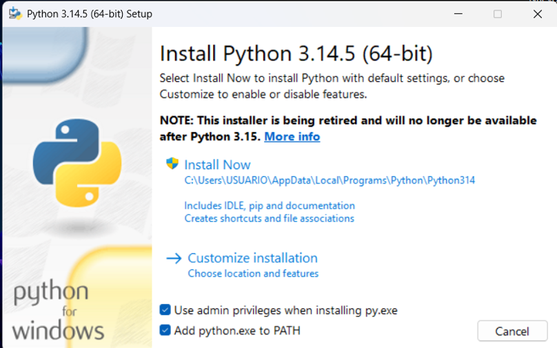

# Buscador Semántico de Repostería

Este proyecto es un buscador semántico desarrollado con **React** y **Flask**. Permite cargar una ontología en formato `.owx` y buscar información relacionada con productos, recetas, ingredientes, herramientas y relaciones del dominio de la repostería.

---

## 1. Descripción del proyecto

El sistema utiliza una ontología de repostería para representar conocimiento mediante clases, individuos, propiedades y relaciones.
El buscador permite consultar elementos como:

* Productos de repostería
* Ingredientes
* Recetas
* Herramientas
* Clases
* Relaciones semánticas
* Atributos de los individuos

---

## 2. Tecnologías utilizadas

* **Python 3.14.5**
* **Flask**
* **React**
* **Tailwind CSS**
* **Typescript**
* **Ontología OWX / OWL XML**
* **DBpedia**
* **JSON local para respaldo offline**

---

## 3. Descargar e instalar Python

Para ejecutar el backend se debe instalar Python desde la página oficial:

https://www.python.org/downloads/windows/

Se recomienda usar **Python 3.14.5 (64-bit)** o una versión estable superior.

Al abrir el instalador de Python, antes de instalar se deben marcar las siguientes opciones:

* **Add python.exe to PATH**
* **Use admin privileges when installing py.exe**

La opción más importante es:

```text
Add python.exe to PATH
```

Esta opción permite usar los comandos `python` y `pip` desde la terminal.

Imagen de referencia:



Luego presionar:

```text
Install Now
```

---

## 4. Descargar de Node js

Para ejecutar el frontend se debe instalar Node js desde la página oficial:

https://nodejs.org/es

Se recomienda usar la versión **LTS** (Long Term Support) para garantizar estabilidad y compatibilidad.

---

## 5. Estructura del proyecto

La estructura del proyecto debe quedar de la siguiente forma:

```text
buscador-reposteria/
├── backend/
│   ├── app.py
│   ├── requirements.txt
│   ├── ontologia/
│   │   └── reposteria.owx
│   ├── services/
│   │   └── dbpedia.py
│   ├── data/
│   │   └── dbpedia_reposteria.json
│   └── static/
│       └── instalacion-python.png
├── frontend/
│   ├── package.json
│   ├── vite.config.ts
│   └── src/
│       ├── App.tsx
│       ├── App.css
│       ├── main.tsx
│       ├── index.css
│       ├── hooks/
│       ├── components/
│       ├── types/
│       └── config/
└── README.md
```

Se agregaron dos archivos importantes para la búsqueda con DBpedia y el modo offline:

```text
backend/services/dbpedia.py
```

Este archivo permite consultar DBpedia de manera online. También controla el tiempo máximo de espera y usa un respaldo offline cuando DBpedia tarda, falla o no encuentra resultados útiles.

```text
backend/data/dbpedia_reposteria.json
```

Este archivo contiene datos locales de respaldo para que el buscador pueda seguir mostrando resultados aunque no haya internet o DBpedia no responda correctamente.

---

## Instalación

Backend:

```powershell
cd backend
pip install -r requirements.txt
```

Frontend:

```powershell
cd frontend
npm install
```

---

## Ejecutar

Para ejecutar el proyecto se deben abrir dos terminales:

* Una terminal para el backend
* Una terminal para el frontend

---

### Backend en modo combinado

Este es el modo recomendado porque usa:

```text
Ontología local + DBpedia online + respaldo offline
```

Ejecutar en PowerShell:

```powershell
cd backend
$env:USE_DBPEDIA="true"
$env:DBPEDIA_TIMEOUT="3"
python app.py
```

Con este modo, el sistema busca en la ontología local y también intenta consultar DBpedia online.

Si DBpedia tarda, falla o no encuentra resultados útiles, el sistema usa automáticamente el archivo offline:

```text
backend/data/dbpedia_reposteria.json
```

---

### Backend en modo offline

Este modo sirve cuando no hay internet o cuando se quiere que el buscador responda más rápido.

Ejecutar en PowerShell:

```powershell
cd backend
$env:USE_DBPEDIA="false"
python app.py
```

En este modo no se consulta internet. Solo se usa:

```text
Ontología local + archivo JSON offline
```

---

### Frontend

Ejecutar en otra terminal:

```powershell
cd frontend
npm run dev
```

---

## Acceso

Frontend: `http://localhost:5173`

Backend: `http://localhost:5000`

Probar resumen de la ontología:

`http://localhost:5000/api/resumen`

Probar búsqueda:

`http://localhost:5000/api/buscar?termino=torta`

Probar búsqueda sin DBpedia:

`http://localhost:5000/api/buscar?termino=torta&dbpedia=0`
